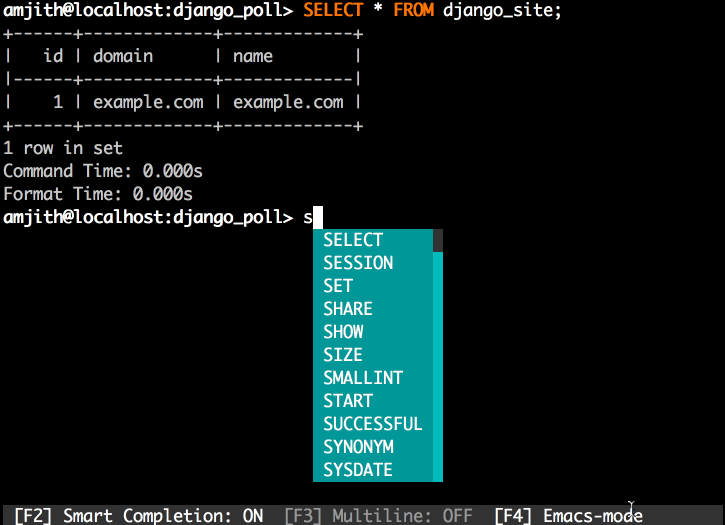

# mycli

[](https://travis-ci.org/dbcli/mycli)
[](https://pypi.python.org/pypi/mycli)
[](https://gitter.im/dbcli/mycli?utm_source=badge&utm_medium=badge&utm_campaign=pr-badge&utm_content=badge)

A command line client for MySQL that can do auto-completion and syntax highlighting.

HomePage: [http://mycli.net](http://mycli.net)

Debian Packages via [PackageCloud.io](https://packagecloud.io/amjith/mycli).




Postgres Equivalent: [http://pgcli.com](http://pgcli.com)

Quick Start
-----------

If you already know how to install python packages, then you can install it via pip:

You might need sudo on linux.

```
$ pip install mycli
```

or

```
$ brew update && brew install mycli  # Only on OS X
```

Check the [detailed install instructions](#detailed-install-instructions) for debian packages or getting started with pip.

### Usage

    $ mycli --help
    Usage: mycli [OPTIONS] [DATABASE]

    Options:
      -h, --host TEXT               Host address of the database.
      -P, --port TEXT               Port number to use for connection. Honors
                                    $MYSQL_TCP_PORT
      -u, --user TEXT               User name to connect to the database.
      -S, --socket TEXT             The socket file to use for connection.
      -p, --password                Force password prompt.
      --pass TEXT                   Password to connect to the database
      --ssl-ca PATH                 CA file in PEM format
      --ssl-capath TEXT             CA directory
      --ssl-cert PATH               X509 cert in PEM format
      --ssl-key PATH                X509 key in PEM format
      --ssl-cipher TEXT             SSL cipher to use
      --ssl-verify-server-cert      Verify server's "Common Name" in its cert
                                    against hostname used when connecting. This
                                    option is disabled by default
      -v, --version                 Version of mycli.
      -D, --database TEXT     	    Database to use.
      -R, --prompt TEXT             Prompt format (Default: "\t \u@\h:\d> ")
      -l, --logfile FILENAME        Log every query and its results to a file.
      --defaults-group-suffix TEXT  Read config group with the specified suffix.
      --defaults-file PATH          Only read default options from the given file
      --auto-vertical-output        Automatically switch to vertical output mode
                                    if the result is wider than the terminal
                                    width.
      -t, --table                   Display batch output in table format.
      --warn / --no-warn            Warn before running a destructive query.
      --local-infile BOOLEAN        Enable/disable LOAD DATA LOCAL INFILE.
      --login-path TEXT             Read this path from the login file.
      --help                        Show this message and exit.

### Examples

    $ mycli local_database

    $ mycli -h localhost -u root app_db

    $ mycli mysql://amjith@localhost:3306/django_poll

Features
--------

`mycli` is written using [prompt_toolkit](https://github.com/jonathanslenders/python-prompt-toolkit/).

* Auto-completion as you type for SQL keywords as well as tables, views and
  columns in the database.
* Syntax highlighting using Pygments.
* Smart-completion (enabled by default) will suggest context-sensitive completion.
    - `SELECT * FROM <tab>` will only show table names.
    - `SELECT * FROM users WHERE <tab>` will only show column names.
* Support for multiline queries.
* Favorite queries. Save a query using `\fs alias query` and execute it with `\f alias` whenever you need.
* Timing of sql statments and table rendering.
* Config file is automatically created at ``~/.myclirc`` at first launch.
* Log every query and its results to a file (disabled by default).
* Pretty prints tabular data.
* Support for SSL connections

Contributions:
--------------

If you're interested in contributing to this project, first of all I would like
to extend my heartfelt gratitude. I've written a small doc to describe how to
get this running in a development setup.

https://github.com/dbcli/mycli/blob/master/DEVELOP.rst

Please feel free to reach out to me if you need help.

My email: amjith.r@gmail.com

Twitter: [@amjithr](http://twitter.com/amjithr)

## Detailed Install Instructions:

### Debian/Ubuntu Package:

The debian package for `mycli` is hosted on [packagecloud.io](https://packagecloud.io/amjith/mycli).

Add the gpg key for packagecloud for package verification.

```
curl https://packagecloud.io/gpg.key | apt-key add -
```

Install a package called apt-transport-https to make it possible for apt to fetch packages over https.

```
apt-get install -y apt-transport-https
```

Add the mycli package repo to the apt source.

```
echo "deb https://packagecloud.io/amjith/mycli/ubuntu/ trusty main" | sudo tee -a /etc/apt/sources.list
```

Update the apt sources and install mycli.

```
$ sudo apt-get update
$ sudo apt-get install mycli
```

Now `mycli` can be upgraded easily by using ``sudo apt-get upgrade mycli``.

### RHEL, Centos, Fedora:

I haven't built an RPM package for mycli yet. So please use `pip` to install `mycli`. You can install pip on your system using:

```
$ sudo yum install python-pip
```

Once that is installed, you can install mycli as follows:

```
$ sudo pip install mycli
```

### Thanks:

This project was funded through kickstarter. My thanks to the [backers](http://mycli.net/sponsors) who supported the project.

A special thanks to [Jonathan Slenders](https://twitter.com/jonathan_s) for
creating [Python Prompt Toolkit](http://github.com/jonathanslenders/python-prompt-toolkit),
which is quite literally the backbone library, that made this app possible.
Jonathan has also provided valuable feedback and support during the development
of this app.

[Click](http://click.pocoo.org/3/) is used for command line option parsing
and printing error messages.

Thanks to [PyMysql](http://www.pymysql.org/) for a pure python adapter to MySQL database.

[Tabulate](https://pypi.python.org/pypi/tabulate) library is used for pretty printing the output of tables.


### Compatibility

Tests have been run on OS X and Linux.

THIS HAS NOT BEEN TESTED IN WINDOWS, but the libraries used in this app are Windows compatible. This means it should work without any modifications. If you're unable to run it on Windows, please file a bug. I will try my best to fix it.
