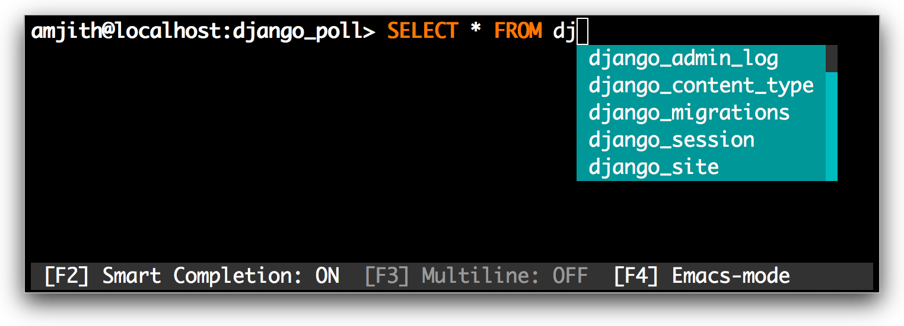
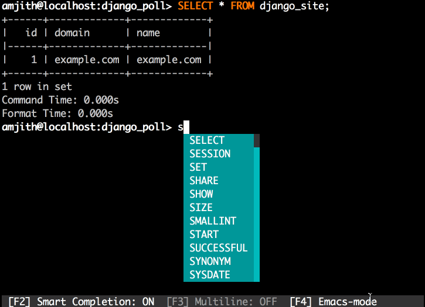

# mycli

[](https://github.com/dbcli/mycli/actions?query=workflow%3Amycli)

A command line client for MySQL with auto-completion and syntax highlighting.

Homepage: [https://mycli.net](https://mycli.net)
Documentation: [https://mycli.net/docs](https://mycli.net/docs)




Mycli is compatible with MySQL, MariaDB, Percona, TiDB, and Apache Doris.

Postgres Equivalent: [https://pgcli.com](https://pgcli.com)

Release 2.x
-----------

Release 2.0.0 has [breaking changes](https://github.com/dbcli/mycli/blob/v2.0.0/changelog.md#breaking-changes)!


Quick Start
-----------

If you already know how to install Python packages, then you can install mycli
via `pip`.  This pakage is always up to date.

You might need `sudo` on Linux.

```bash
pip install --upgrade 'mycli[all]'
```

or, only on macOS (`fzf` and `pygments` are optional):

```bash
brew update && brew install mycli fzf pygments
```

or, only on Debian or Ubuntu (`fzf` and `pygments` are optional):

```bash
sudo apt-get install mycli fzf python3-pygments
```

### Usage

See

```bash
mycli --help
```

Features
--------

* Auto-completion as you type for SQL keywords as well as tables, views,
  columns, enums, and more!
* Fuzzy history search using [fzf](https://github.com/junegunn/fzf).
* Syntax highlighting using [Pygments](https://pygments.org/).
* Smart-completion (enabled by default) will suggest context-sensitive completion.
    - `SELECT * FROM <tab>` will only show table names.
    - `SELECT * FROM users WHERE <tab>` will only show column names.
* Support for multiline queries.
* Favorite queries with optional positional parameters. Save a query using
  `/fs <alias> <query>` and execute it with `/f <alias>`.
* Timing of sql statements and table rendering.
* Log every query and its results to a file (disabled by default).
* Pretty print tabular data (with colors!).
* Support for SSL connections
* Shell-style trailing redirects with `$>`, `$>>` and `$|` operators.
* Support for querying LLMs with context derived from your schema using `/llm`.
* Support for storing passwords in the system keyring.

Mycli creates a config file `~/.myclirc` on the first run; you can use the
options in that file to configure the above features, and more.

Some features are only exposed as [key bindings](doc/key_bindings.rst).


Implementation
--------------

`mycli` is written using [prompt_toolkit](https://github.com/jonathanslenders/python-prompt-toolkit/) and other Python libraries.


Contributions
-------------

If you're interested in contributing to this project, first of all we would like
to extend our heartfelt gratitude. We've written a small doc to describe how to
get mycli running in a development setup.

https://github.com/dbcli/mycli/blob/main/CONTRIBUTING.md


## Additional Install Instructions:

These are some alternative ways to install mycli that are not managed by our
team but provided by OS package maintainers.  OS packages could be somewhat
out of date.

If present, the `fzf` package can be used for fuzzy history search, and
`pygemtize` can be used for syntax highlighting within the fuzzy history
search.  The `less` package is also expected, but almost always already
installed.

### Arch, Manjaro

You can install the `mycli` package available in the AUR.  `fzf` and
`python-pygments` are optional:

```bash
yay -S mycli fzf python-pygments
```

### Debian, Ubuntu

On Debian and Ubuntu distributions, you can easily install the mycli package
using apt.  The `fzf` and `python3-pygments` packages are optional:

```bash
sudo apt-get install mycli fzf python3-pygments
```

### Fedora

Fedora has a package available for mycli; install it using dnf.  The `fzf` and
`python-pygments` packages are optional:

```
sudo dnf install mycli fzf python-pygments
```

### Windows

#### Option 1: Native Windows

Install the `less` pager, for example by `scoop install less`.

Follow the instructions on this blogpost: https://web.archive.org/web/20221006045208/https://www.codewall.co.uk/installing-using-mycli-on-windows/

The libraries used in mycli are Windows-compatible, but there are known
limitations according to the test suite.  The basics work without any
modifications, but this configuration isn't supported software at this time.

PRs to address shortcomings on Windows would be welcome!

#### Option 2: WSL

Mycli is more compatible with WSL than with native Windows, though still
not 100% perfect.  This is a good option for using mycli on Windows.

PRs to complete WSL support would be welcome!

### Thanks

This project was funded through kickstarter. Our thanks to the [backers](https://mycli.net/sponsors) who supported the project.

A special thanks to [Jonathan Slenders](https://twitter.com/jonathan_s) for
creating [Python Prompt Toolkit](https://github.com/jonathanslenders/python-prompt-toolkit),
which is quite literally the backbone library, that made this app possible.
Jonathan has also provided valuable feedback and support during the development
of this app.

[Click](https://palletsprojects.com/projects/click) is used for command line option parsing
and printing error messages.

Thanks to [PyMysql](https://github.com/PyMySQL/PyMySQL) for a pure Python adapter to MySQL databases.


### Compatibility

Mycli is tested on macOS (full), Linux (full), Windows (partial), and WSL
(partial), and requires Python 3.10 or better.

To connect to MySQL versions earlier than 5.5, you may need to set the
following in `~/.myclirc`:

```
[connection]
# character set for connections without --charset being set at the CLI
default_character_set = utf8
```

or set `--charset=utf8` when invoking MyCLI.

### Configuration and Usage

For more information on using and configuring mycli, [check out our documentation](https://mycli.net/docs).

Common topics include:
- [Configuring mycli](https://mycli.net/config)
- [Using/Disabling the pager](https://mycli.net/pager)
- [Syntax colors](https://mycli.net/syntax)
